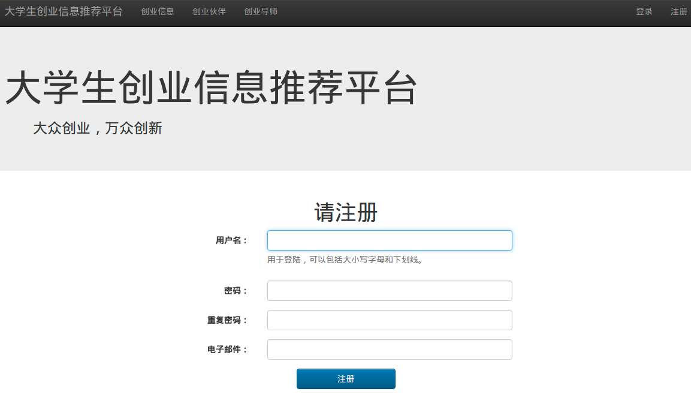
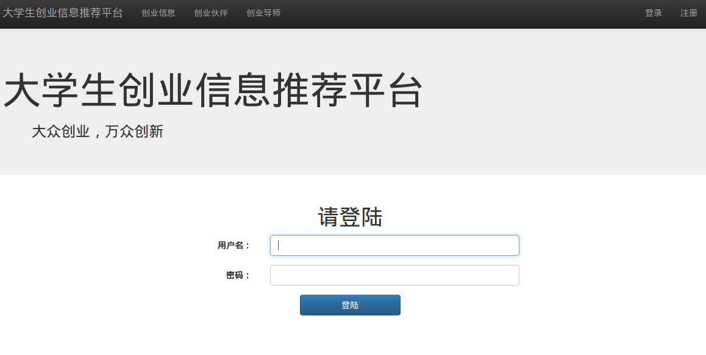

# Cool_Information_Recommendation

<s>创业</s>信息推荐平台

一个网站，一个推荐系统

通过分析 用户在网站上阅读文章的行为操作和属性，为用户推荐可能感兴趣的文章、兴趣相投的其他用户

---

---

## 开发环境以及版本

||名称及版本|
|:---|---:|
|操作系统|Ubuntu 14.04 LTS|
|编辑器|Vim 7.4|
|服务器软件|Apache ???|
|数据库|MySQL 5.5|
|开发语言|Python 3.4|
|后台框架|Django 1.8 LTS|
|前端框架|Bootstrap 3|

---

## 运行测试

---

## 开发日志（+日常吐槽）

### Version 0.1 阶段总结

实现了的功能：

- 

然后还要做的：

- 界面美化，网站改进优化

- 推荐系统改进优化，加入用户的注册信息，建立用户画像……

- 迁移到分布式平台，Hadoop/Spark集群上

### 2016.4 预期

初步完成推荐系统，实现简单的 “基于用户的协同过滤算法”、“基于物品的协同过滤算法”，之后迭代完善

进行算法测试

学习使用腾讯云，部署网站，配置 Apache/Nginx，处理Django的静态文件，图片的存储。。。

初步实现"用户——文章"操作行为的存储、读取

充实网站的内容，虽然没有真实的数据，但全都是相同的图片，乱写的文字也太难看了。。。

初步完成推荐系统设计及其伪代码

### 2016.4.28

### 2016.4.27

参加阿里云栖大会（南京峰会），听阿里总裁谈云计算大数据，听阿里技术专家谈架构，虽然不能完全理解，但是感觉自己选对了路，以后深入学习数据挖掘

其实大二下期末就有从事数据挖掘的想法，但是直到现在（大三下），学习时间几本都花在了Linux、Web开发、基础技能上，数据挖掘的东西零零碎碎看了一点点点点。。。确实得调整自己的学习计划、学习方法…… 囧rz...

### 2016.4.25~2016.4.26

初步完成 “注册” 板块，Django不够熟悉，掉进了好多坑。。。

初步完成文章内容页面，太简单了。。。

### 2016.4.22~2016.4.23

又看了些Django的文档，看多了就理解为什么有人说“Django太重了。。。”，想把文档下载了看，发现pdf版1607页，吓料了 Orz...想游刃有余地用Django，要学好多Django造好的轮子。。。想做完这个去学flask吧，但是flask又有一堆插件要学。。。已经投入这么多精力学Django了，不如就继续深入学习吧。。。

当当买书，人多的app直接爆炸，各种链接失败，好不容易下单了，一本《算法》竟然已经没货了。。。悲伤辣磨大，欢乐辣么小～～～

23号参加 segmentfault D-day 南京站 线下分享活动，听大牛们分享“swift”、“docker”、“前端”，感觉棒棒的，虽然很多听不懂，长长见识也好～～～

### 2016.4.18~2016.4.20

阅读 Django1.8文档，“认证”、“日志”、“会话”

初步完成 “登陆”、“注销” 板块，网站初步搭建完成

今天科协换届结束～～～又少了一件事情～～～

当当有活动，过几天满400减200，整理了一下自己的学习路线、考研计划，挑选了好多书～～～

### 2016.4.16~2016.4.17

初步完成数据库设计，比较简单，但是先做出demo来吧，后面再迭代

初步完成 “创业伙伴”板块，本来想采用瀑布流，尝试了一下没成功，好多不会，还是先做简单的，效果后面再加吧

驾校科目三学完啦～～～五一后接着学科目二～～～五一前做出demo

### 2016.4.12~2016.4.15

- 周二上午，实验课，“软件测试——黑盒测试”，为什么我觉得是大学以来的实验课中，对编程要求最高的？Orz...理解老师的字面要求也花了不少时间。。。
- 周三下午，去驾校，科目三第4次课，大马路上练习掉头，车流更大，难多了。。。之前没怎么熄火过，这天熄火了好几次。。。囧rz...每次去完驾校，都超级累。。。
- 周四上午，实验课，“编译原理——词法分析”，哎。。。重修课。。。上学期太浪了。。。其实我挺喜欢这门课的，虽然教材还是97年的。。。好想自己写一个编译器～～～
- 周四上午，科协要换届了，和屈大带着学弟学妹去见团委老师，等了好久（学弟都睡着了），然后听团委老师说了好多。。。
- 周四下午，实验课，“数据库——Oracle Plus”，软件可旧了，v7还是v8的，参加的线下活动，听企业负责人提到“去Oracle化”也不是一两次了，为什么学校这么有钱买Oracle？？？
- 周四晚上，实验课，“嵌入式系统开发——Linux内核裁剪”，只是体验，按照老师给的步骤一步步做基本没问题，挺有意思的～～～
- 周五下午，实验课，“UML实验”，上学期别的班还用的IBM Rose，这学期就换IBM RSA，学校就是有钱。。。但是那个软件根本不造怎么用。。。有那个软件的机房还不开放，愁。。。
- 周五下午，实验课，“市场营销——设计调查问卷”，是实验三，正好是我负责的，问题不大

所以，这周6个实验课，去驾校，科协换届准备，看科比退役最后一场比赛，基本是疲于奔命。。。没做什么，Github上连续空了好几天。。。Orz...

感觉事情少，可以从早学到晚，事情一多，自己就越偷懒，效率低，还更想玩游戏，是放松还是逃避？？？时间安排、自律、目标什么的。。。要加油啊～！啊啊啊～～～！！！

### 2016.4.9~2016.4.11

初步完成 “首页” 和 “创业信息” 板块

用JS实现 当页面元素不够时，footer 置底。。。JS判断 body的高度<浏览器的高度时，给footer增加 navbar-fixed-bottom 类

有时不能联网（比如答辩时），不用 Bootstrap3 的CDN加速，改用静态文件

刷完知乎上“推荐系统”相关的问答，并记录需要的信息，有用的问答好少，貌似关注推荐系统的人不多啊。。。

### 2016.4.9 之前

2016.3月～4月初，继续学习网上的数个 Django教程，[慕课网上过了一遍 Bootstrap3的教程](https://github.com/TomatoFishes/Exercise_imooc_Web)，同时[看《推荐系统实践》学习“协同过滤算法”](https://github.com/TomatoFishes/Learn_RecSystem)

2016.1月中旬～2月末，寒假，[学习Python3，Django1.8框架](https://github.com/TomatoFishes/Exercise_ProLang_Python3_Exercise)。。。偏爱vim，于是[学vimscript，配置vim插件](https://github.com/TomatoFishes/Learn_VimScript)，过年

2015.11月下旬～2016.1月初，期末考试备考。。。

2015.10月~2015.11中旬，简单学习前端，了解Bootstrap3，做出网站的静态页面。。。

2015.4月～2015.9月末，4月确定要做这个推荐系统以及网站平台，6个月，时间宽裕不慌不忙，基本没做什么，不知道什么是推荐系统，搜集了一些资料，认为需要Hadoop/Spark，断断续续学了点，主要参加其他课外活动。。。Orz...

---

## 借鉴参考

[Django 1.8.2 中文文档](http://python.usyiyi.cn/django/index.html)

[Bootstrap3 中文文档](http://v3.bootcss.com/)

[自强学堂_Django 基础教程](http://www.ziqiangxuetang.com/django/django-tutorial.html)

[Django搭建简易博客教程](https://andrew-liu.gitbooks.io/django-blog/content/index.html) ---> 分页功能的实现，其实文档里有